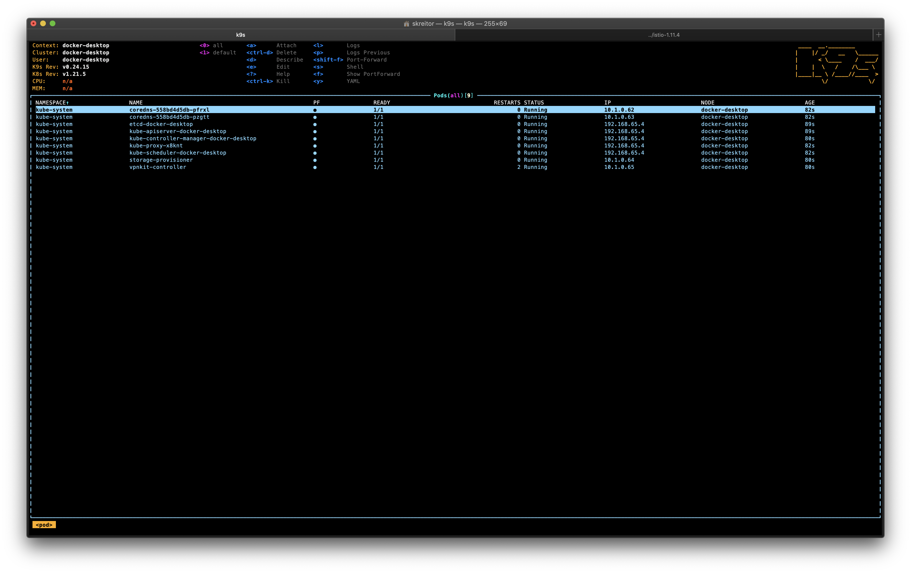
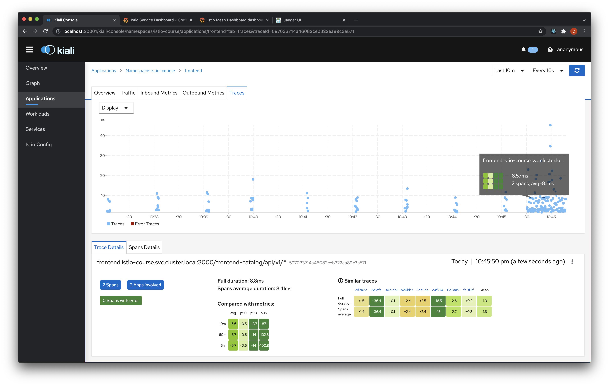

# Table of Contents  
* [Prerequisities](#prerequisities)
    1. [Kubernetes setup](#prerequisities-k8s)
    2. [Istio setup](#prerequisities-istio)
        1. [Istioctl tool](#prerequisities-istio-istioctl)
        2. [Istio install](#prerequisities-istio-install)
        3. [Istio addons install](#prerequisities-istio-addons-install)
    3. [Node/npm setup](#prerequisities-node)
* [Setup applications](#apps-setup)
    1. [Install dependencies](#apps-setup-dependencies)
    2. [Build bundles](#apps-setup-dist)
    3. [Build docker images](#apps-setup-build)
* [Deploy applications](#apps-deploy)
    1. [Create namespace](#apps-deploy-ns)
    2. [Prepare gateways](#apps-deploy-infra)
    3. [Deploy apps](#apps-deploy-apps)
* [Observability and monitoring tools check](#infra-check)
    1. [Setup tools](#infra-check-setup)
    2. [Check kiali](#infra-check-kiali)
    3. [Check jaeger](#infra-check-jaeger)
    4. [Check grafana](#infra-check-grafana)
    5. [Check service response](#infra-check-response)

<div id="prerequisities"/>

## Prerequisities

<div id="prerequisities-k8s"/>

1. Prepare k8s cluster (docker)

    <figure class="video_container">
    <video controls="true" allowfullscreen="true" width="820" height="640" poster="https://kubernetes.io/images/favicon.png">
        <source src="./k8s-enablement.mp4">
    </video>
    </figure>

    Verify you see in k9s the following picture
    

    NOTE: if you want to deploy metrics server in k8s cluster you must use minikube or some other tool to prepare k8s cluster as docker desktop supports only 1 node k8s cluster but metrics server requires non single node cluster.

<div id="prerequisities-istio"/>

2. Install istio

    <div id="prerequisities-istio-istioctl"/>

    1. Follow the [`istioctl` tool installation instructions](https://istio.io/latest/docs/setup/getting-started/#download) to have it enabled in the PATH

    <div id="prerequisities-istio-install"/>

    2. Install istio with demo profile
        ```shell script
        > istioctl install --set profile=demo -y
        ✔ Istio core installed
        ✔ Istiod installed
        ✔ Egress gateways installed
        ✔ Ingress gateways installed
        ✔ Installation complete
        Thank you for installing Istio 1.11.  Please take a few minutes to tell us about your install/upgrade experience!  https://forms.gle/kWULBRjUv7hHci7T6
        ```
        
        Verify everything is up and no erros observed
        ```shell script
        > kubectl get deployments -n istio-system
        NAME                                    READY   STATUS    RESTARTS   AGE
        istio-egressgateway-756d4db566-nzf7f    1/1     Running   0          111s
        istio-ingressgateway-8577c57fb6-rllj6   1/1     Running   0          111s
        istiod-5847c59c69-bwnb6                 1/1     Running   0          2m13s
        ```
        

        NOTE: you might encounter issues with the assigning EXTERNAL_IP to istioingress-gateway (stucks in <pending> state). For docker desktop complete images delete helped.

    <div id="prerequisities-istio-addons-install"/>

    3. Install istio addons/extensions (kiali, prometheus, jaeger, grafana)
        ```shell script
        > kubectl apply -f istio-1.11.4/samples/addons
        serviceaccount/grafana created
        configmap/grafana created
        service/grafana created
        deployment.apps/grafana created
        configmap/istio-grafana-dashboards created
        configmap/istio-services-grafana-dashboards created
        deployment.apps/jaeger created
        service/tracing created
        service/zipkin created
        service/jaeger-collector created
        serviceaccount/kiali created
        configmap/kiali created
        clusterrole.rbac.authorization.k8s.io/kiali-viewer created
        clusterrole.rbac.authorization.k8s.io/kiali created
        clusterrolebinding.rbac.authorization.k8s.io/kiali created
        role.rbac.authorization.k8s.io/kiali-controlplane created
        rolebinding.rbac.authorization.k8s.io/kiali-controlplane created
        service/kiali created
        deployment.apps/kiali created
        serviceaccount/prometheus created
        configmap/prometheus created
        clusterrole.rbac.authorization.k8s.io/prometheus created
        clusterrolebinding.rbac.authorization.k8s.io/prometheus created
        service/prometheus created
        deployment.apps/prometheus created
        ```

        Verify addons are up and do not have any errors
        ```shell script
        > kubectl get pods -n istio-system
        NAME                                    READY   STATUS    RESTARTS   AGE
        grafana-68cc7d6d78-4hszt                1/1     Running   0          96s
        istio-egressgateway-756d4db566-nzf7f    1/1     Running   0          8m17s
        istio-ingressgateway-8577c57fb6-rllj6   1/1     Running   0          8m17s
        istiod-5847c59c69-bwnb6                 1/1     Running   0          8m39s
        jaeger-5d44bc5c5d-jxggl                 1/1     Running   0          96s
        kiali-fd9f88575-plxxl                   1/1     Running   0          96s
        prometheus-77b49cb997-jqt2s             2/2     Running   0          95s
        ```
        

<div id="prerequisities-node"/>

3. Follow instructions on [nodejs.org](https://nodejs.org/uk/download/) to install Node and npm and verify Node and npm are available in the PATH
    ```shell script
    > node -v
    v16.3.0
    > npm -v
    8.1.2
    ```

<div id="apps-setup"/>

## Setup applications

<div id="apps-setup-dependencies"/>

1. Install application's dependencies (for each)
    ```shell script
    > npm ci
    ```
    TIP: Use `npm ci` to install locked in package.lock file dependencies
    

<div id="apps-setup-dist"/>

2. Build applications (from the directory which contains `scripts` folder)
    ```shell script
    ./scripts/build-components.sh

    > authors@0.0.1 prebuild
    > rimraf dist


    > authors@0.0.1 build
    > nest build


    > books@0.0.1 prebuild
    > rimraf dist


    > books@0.0.1 build
    > nest build


    > frontend@0.0.1 prebuild
    > rimraf dist


    > frontend@0.0.1 build
    > nest build

    ```
    Verify all the three apps have `dist` folder
    

<div id="apps-setup-build"/>

3. Build docker images (from the directory which contains `scripts` folder). Don't forget to change image name to yours.
    ```shell script
    > ./scripts/publish-components.sh
    ...
    Successfully tagged kreyyser/frontend-service:1.0
    ...
    Successfully tagged kreyyser/books-service:1.0
    ...
    Successfully tagged kreyyser/authors-service:1.0
    ```

<div id="apps-deploy"/>

## Deploy applications

<div id="apps-deploy-ns"/>

1. Prepare namespace for applications deployment
    * Create it
        ```shell script
        > kubectl create namespace istio-course
        namespace/istio-course created
        ```
    * Label for sidecars injection
        ```shell script
        > kubectl label namespace istio-course istio-injection=enabled
        namespace/istio-course labeled
        > kubectl get namespace -L istio-injection
        NAME              STATUS   AGE     ISTIO-INJECTION
        default           Active   57m     
        istio-course      Active   2m16s   enabled
        istio-system      Active   55m     
        kube-node-lease   Active   57m     
        kube-public       Active   57m     
        kube-system       Active   57m     
        ```

<div id="apps-deploy-infra"/>

2. Create ingress and gateway controllers to the `istio-course` namespace (from the directory which contains `scripts` folder)
    ```shell script
    > ./scripts/configure-routing.sh
    ingress.networking.k8s.io/course-istio-gateway created
    gateway.networking.istio.io/course-frontend-gateway created
    virtualservice.networking.istio.io/course-istio created
    ```

<div id="apps-deploy-apps"/>

3. Deploy application's deployments, services and service accounts to the `istio-course` namespace. Don't forget to change image name to yours.
    ```shell script
    > ./scripts/deploy-components.sh
    service/authors created
    serviceaccount/servicemesh-authors created
    deployment.apps/authors-v1 created
    service/books created
    serviceaccount/servicemesh-books created
    deployment.apps/books-v1 created
    service/frontend created
    serviceaccount/servicemesh-frontend created
    deployment.apps/frontend-v1 created
    ```
    

<div id="infra-check"/>

## Check observability and monitoring tools

<div id="infra-check-setup"/>

1. Expose kiali, jaeger and grafana

    ```shell script
    > istioctl dashboard kiali
    http://localhost:20001/kiali
    > istioctl dashboard grafana
    http://localhost:3000
    > istioctl dashboard jaeger
    http://localhost:16686
    ```

<div id="infra-check-kiali"/>

2. Check kiali

    * Applications tab
    
    
    

    * Graph
    
    

<div id="infra-check-jaeger"/>

3. Check jaeger


<div id="infra-check-grafana"/>

4. Check grafana

    * Mesh related dashboards

    
    
    

    * Authors service dashboards

    
    

    * Books service dashboards

    
    

    * Frontend service dashboards

    
    

<div id="infra-check-response"/>

5. Check service response
