# Table of Contents  
* [Prerequisities](#prerequisities)
* [Canary deployment](#canary)
    1. [Prepare v2 services](#canary-prepare)
    2. [Prepare deployment files](#canary-deployment)
    3. [Deploy 10% canary](#canary-10)
    4. [Deploy 50% canary](#canary-50)
    5. [Deploy 100% canary](#canary-100)
* [Development environment](#dev-env)
    1. [Prerequisities](#dev-env-prerequisities)
    2. [Prepare deployment files](#dev-env-prepare)
    3. [Deploy feature](#dev-env-deploy)
    4. [Test feature](#dev-env-test)
* [Service resiliency](#resiliency)
    1. [Prerequisities](#resiliency-prerequisities)
    2. [Prepare deployments](#resiliency-prepare)
    3. [Deploy](#resiliency-deploy)
    4. [Test](#resiliency-test)

<div id="prerequisities"/>

## Prerequisities

Follow [instructions from hw2](../hw2/README.md) to setup v1 applications state with k8s and istio setup.

<div id="canary"/>

## Canary deployment

<div id="canary-prepare"/>

1. Prepare v2 services

    In order to test canary deployments the v2 of the authors and books services must be prepared. For this to be done make any changes to the response of these sevices and build images with `*-2.0` tag (in my case - `version: '2'` property was added to each book and author).
    ```
    > docker build -t kreyyser/books-service:2.0 -f books/Dockerfile books
    ...
    > docker build -t kreyyser/authors-service:2.0 -f authors/Dockerfile authors
    ```

<div id="canary-deployment"/>

2. Prepare deployment files

    Prepare deployment files for version 2 of books and authors services and apply it by running following command from `hw3/canary/` folder.
    ```
    > make deploy-v2-depl
    kubectl apply -f ./author/deployment.yaml
    deployment.apps/authors-v2 created
    kubectl apply -f ./book/deployment.yaml
    deployment.apps/books-v2 created
    ```

    Verify everything is up and running
    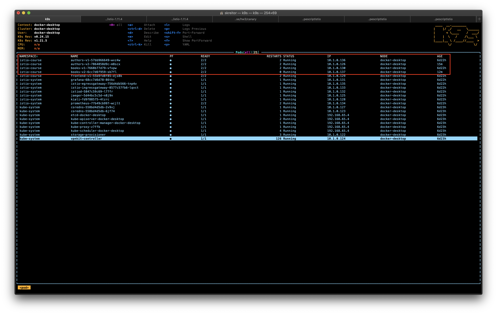

    Start tesing API request by running following command
    ```
    > watch -n 1 curl -o /dev/null -s -w %{http_code} localhost:80/frontend-catalog/api/v1/dashboard
    ```

    Verify even requests distribution in the kiali
    <figure class="video_container">
    <video controls="true" allowfullscreen="true" width="640" height="480" poster="https://kubernetes.io/images/favicon.png">
        <source src="./screenshots/version-2.mov">
    </video>
    </figure>

<div id="canary-10"/>

3. Deploy 10% canary

    Prepare routing related files (VirtualService and DestinationRule) for authors and books services and apply them by running following command from `hw3/canary/` folder.
    ```
    > make deploy-canary-v2-10
    kubectl apply -f ./author/deployment.yaml
    deployment.apps/authors-v2 configured
    kubectl apply -f ./book/deployment.yaml
    deployment.apps/books-v2 configured
    kubectl apply -f ./author/dr.yaml
    destinationrule.networking.istio.io/authors created
    kubectl apply -f ./book/dr.yaml
    destinationrule.networking.istio.io/books created
    kubectl apply -f ./author/vs-10.yaml
    virtualservice.networking.istio.io/authors-v2-10 created
    kubectl apply -f ./book/vs-10.yaml
    virtualservice.networking.istio.io/books-v2-10 created
    ```

    Verify DestinationRule configuration is right.
    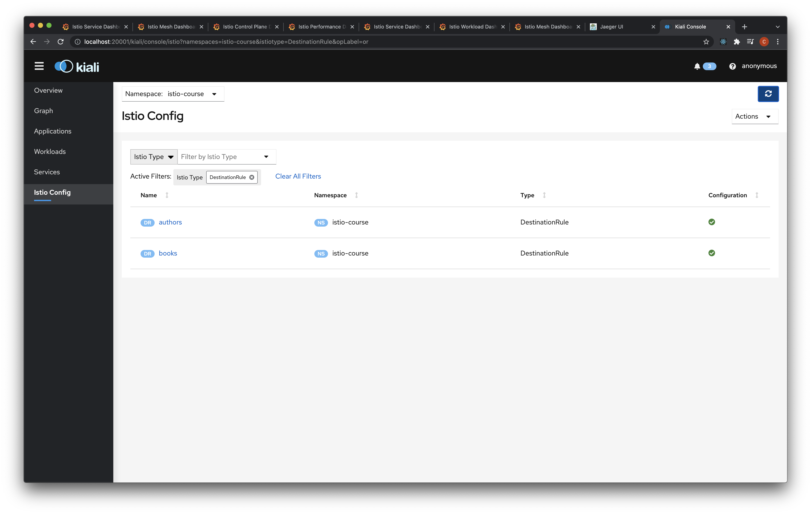

    Verify VirtualService configuration is right.
    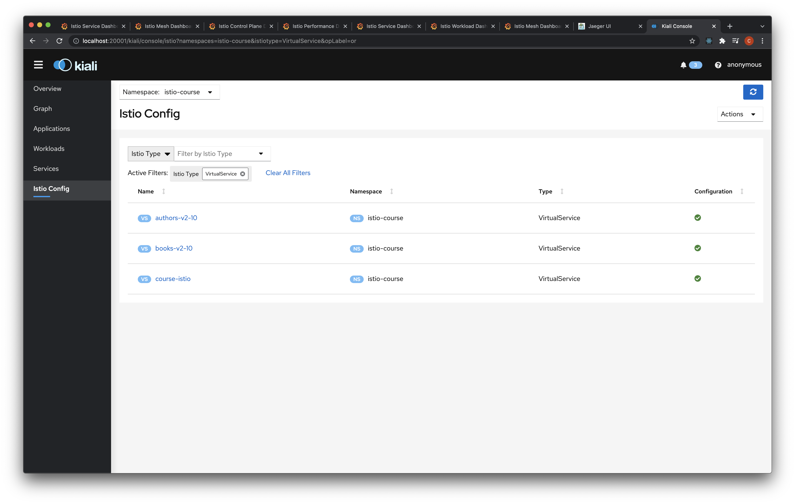

    Verify that traffic flows chart in kiali looks close to the desired 90%/10% v1/v2 version distribution
    <figure class="video_container">
    <video controls="true" allowfullscreen="true" width="640" height="480" poster="https://kubernetes.io/images/favicon.png">
        <source src="./screenshots/canary-traffic-10.mov">
    </video>
    </figure>

<div id="canary-50"/>

3. Deploy 50% canary

    Prepare routing related files (VirtualService and DestinationRule) for authors and books services and apply them by running following command from `hw3/canary/` folder.
    
    NOTE: don't forget to delete previous VirtualService for 90/10 traffic distribution (or you can just change the existing VS configuration)
    ```
    > make deploy-canary-v2-50
    kubectl apply -f ./author/deployment.yaml
    deployment.apps/authors-v2 configured
    kubectl apply -f ./book/deployment.yaml
    deployment.apps/books-v2 configured
    kubectl apply -f ./author/dr.yaml
    destinationrule.networking.istio.io/authors unchanged
    kubectl apply -f ./book/dr.yaml
    destinationrule.networking.istio.io/books unchanged
    kubectl apply -f ./author/vs-50.yaml
    virtualservice.networking.istio.io/authors-v2-50 created
    kubectl apply -f ./book/vs-50.yaml
    virtualservice.networking.istio.io/books-v2-50 created
    ```

    Verify that traffic flows chart in kiali looks close to the desired 50%/50% v1/v2 version distribution
    <figure class="video_container">
    <video controls="true" allowfullscreen="true" width="640" height="480" poster="https://kubernetes.io/images/favicon.png">
        <source src="./screenshots/canary-traffic-50.mov">
    </video>
    </figure>

<div id="canary-100"/>

3. Deploy 100% canary

    Prepare routing related files (VirtualService and DestinationRule) for authors and books services and apply them by running following command from `hw3/canary/` folder.
    
    NOTE: don't forget to delete previous VirtualService for 50/50 traffic distribution (or you can just change the existing VS configuration)
    ```
    > make deploy-canary-v2-100
    kubectl apply -f ./author/deployment.yaml
    deployment.apps/authors-v2 configured
    kubectl apply -f ./book/deployment.yaml
    deployment.apps/books-v2 configured
    kubectl apply -f ./author/dr.yaml
    destinationrule.networking.istio.io/authors unchanged
    kubectl apply -f ./book/dr.yaml
    destinationrule.networking.istio.io/books unchanged
    kubectl apply -f ./author/vs-100.yaml
    virtualservice.networking.istio.io/authors-v2-100 created
    kubectl apply -f ./book/vs-100.yaml
    virtualservice.networking.istio.io/books-v2-100 created
    ```

    Verify that traffic flows chart in kiali looks close to the desired 0%/100% v1/v2 version distribution
    <figure class="video_container">
    <video controls="true" allowfullscreen="true" width="640" height="480" poster="https://kubernetes.io/images/favicon.png">
        <source src="./screenshots/canary-traffic-100.mov">
    </video>
    </figure>

    Verify all the responses you get from calling frontend service have `"version": "2"` property in books and authors.
    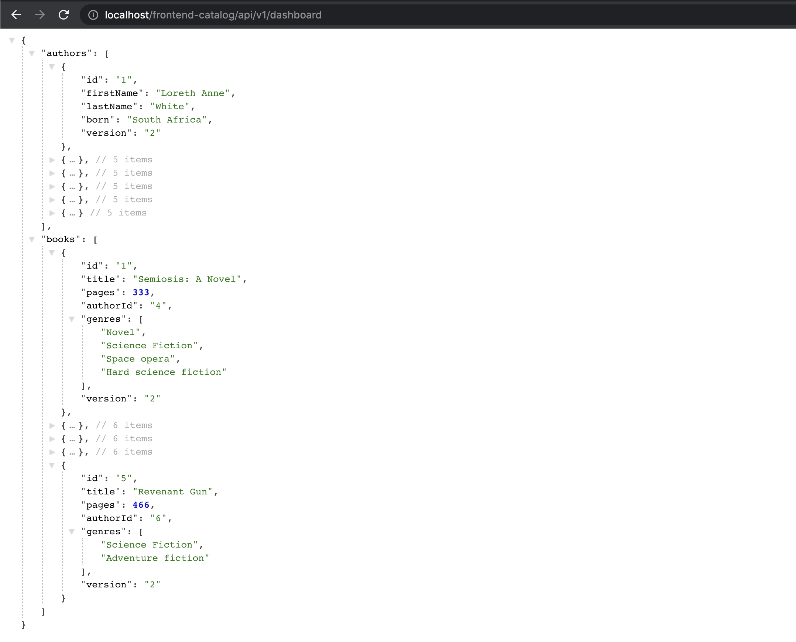

<div id="dev-env"/>

## Development environment

<div id="dev-env-prerequisities"/>

1. Prerequisities

    * In order to test feature flags deployments the `fflag` version of the authors and books services must be prepared. For this to be done add `developer: "your_name"` property to the authors and books services response and publish new version.
        ```bash
        > docker build -t kreyyser/books-service:fflag -f books/Dockerfile books
        ...
        > docker build -t kreyyser/authors-service:fflag -f authors/Dockerfile authors
        ```

    * To pass the desired header from the incoming request to the frontend service down to the authors and books services add it to the request if it is present in the request. Build and publish the image.
        ```
        > docker build -t kreyyser/frontend-service:1.0 -f frontend/Dockerfile frontend
        ```

<div id="dev-env-prepare"/>

2. Prepare deployment files

    * Deployments.
        Prepare new `fflag` version of authors and books services to provide additional response data in the payload. Add proper `fflag` version labels.

    * Destination Rules.
        Prepare new DetinationRule for authors and books services with `fflag` subset.
        ```yaml
        ...
        spec:
            host: books
            subsets:
            - name: v1
                labels:
                version: v1
            - name: v2
                labels:
                version: v2
            - name: fflag
                labels:
                version: fflag
        ```

        NOTE: you can use existing deployed DesinationRule files and just update them with the new subset.

    * Virtual Service.
        Prepare new VirtualService files for authors and books services with matching exact header pointed to `fflag` subset of host routes.
        ```yaml
        spec:
            hosts:
            - authors
            http:
            - match:
                - headers:
                developer:
                    exact: kreyser
                route:
                - destination:
                    host: authors
                    subset: fflag
            - route:
                - destination:
                    host: authors
                    subset: v1
                weight: 10
                - destination:
                    host: authors
                    subset: v2
                weight: 90
        ```

        NOTE: you can use existing deployed VirtualService files and just update them with the new http match rule.

<div id="dev-env-deploy"/>

3. Deploy feature

    To deploy the complete feature just apply all the yaml files from `hw3/devenv/k8s` directory. Or you can run the following command from `hw3/devenv` folder.
    ```
    > make deploy-feature
    kubectl apply -f ./k8s/
    deployment.apps/authors-fflag configured
    deployment.apps/books-fflag configured
    destinationrule.networking.istio.io/books created
    destinationrule.networking.istio.io/authors created
    virtualservice.networking.istio.io/authors-v2-90-fflag created
    virtualservice.networking.istio.io/books-v2-90-fflag created
    ```

    Verify `fflag` version of the deployments is up and running
    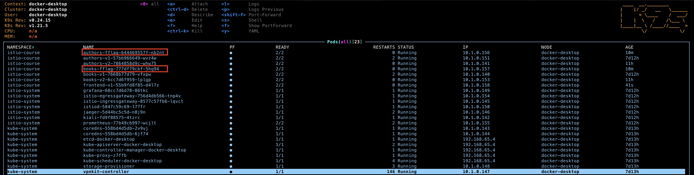

    Verify destination rules and virtual services do not have the errors
    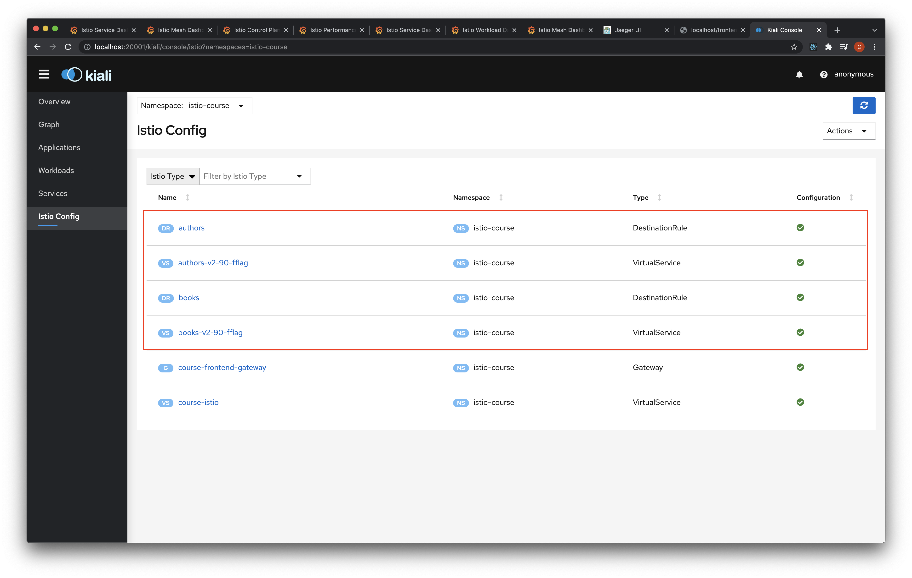

<div id="dev-env-test"/>

3. Test feature

    In order to test the feature flag let's start calling frontend service with `developer: "kreyser"` header.
    ```
    > watch -n 1 curl -H developer:kreyser -o /dev/null -s -w %{http_code} localhost:80/frontend-catalog/api/v1/dashboard
    ```

    Verify that if you send request with `developer: kreyser` header you get `developer: kreyser` in the authors and books payload.
    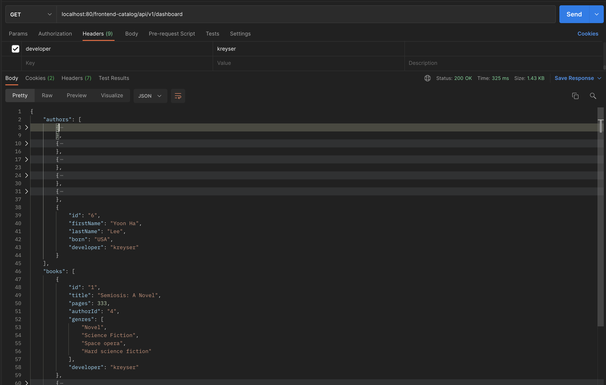

    Verify that all the traffic goes to `fflag` version of the deployments.
    <figure class="video_container">
    <video controls="true" allowfullscreen="true" width="640" height="480" poster="https://kubernetes.io/images/favicon.png">
        <source src="./screenshots/fflag-flow.mov">
    </video>
    </figure>

    Now let's start calling frontend service without `developer: "kreyser"` header.
    ```
    > watch -n 1 curl -o /dev/null -s -w %{http_code} localhost:80/frontend-catalog/api/v1/dashboard
    ```

    Verify that if you send request without `developer: kreyser` header you do not get `developer: kreyser` in the authors and books payload.
    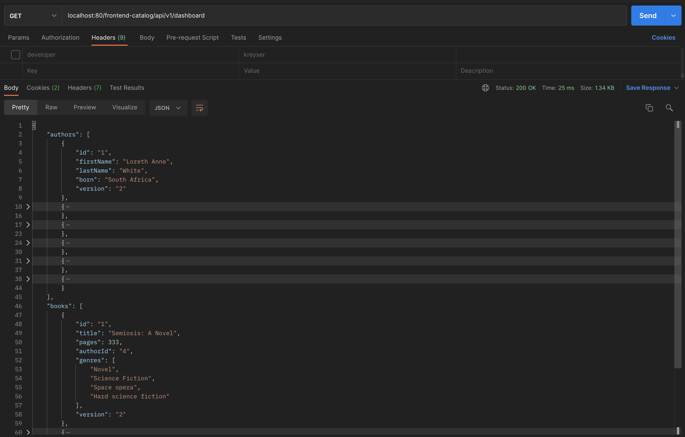

    And sometimes you get v1 response from authors or/and books services.
    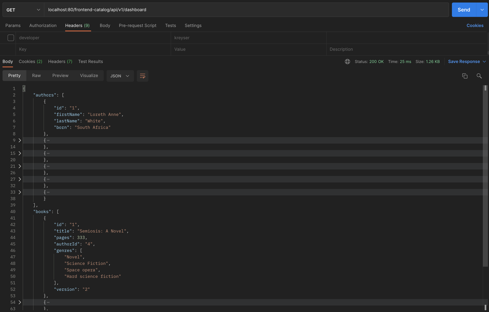

    Observe the kiali traffic board distributed between v1/v2 and fflag versions of the books and authors services.
    <figure class="video_container">
    <video controls="true" allowfullscreen="true" width="640" height="480" poster="https://kubernetes.io/images/favicon.png">
        <source src="./screenshots/fflag-mixed-flow.mov">
    </video>
    </figure>

<div id="resiliency"/>

## Service resiliency

<div id="resiliency-prerequisities"/>

1. Resilience prerequisities

    In order to test resilience let's remove everything that related to the traffic distribution for authors and books services (VirtualService and DestinationRule).

    Let's verify that traffic now is distributed via RoudRobin mechanism.
    <figure class="video_container">
    <video controls="true" allowfullscreen="true" width="640" height="480" poster="https://kubernetes.io/images/favicon.png">
        <source src="./screenshots/resiliency-empty.mov">
    </video>
    </figure>

<div id="resiliency-prepare"/>

2. Prepare deployments

    Now let's prepare destination rules with configured circut breaker for authors with RANDOM load balancer and for books with ROUND_ROBIN load balancer.
    ```yaml
    host: books
    trafficPolicy:
        loadBalancer:
        simple: ROUND_ROBIN
        connectionPool:
        tcp:
            maxConnections: 1
        http:
            http1MaxPendingRequests: 1
            maxRequestsPerConnection: 1
        outlierDetection:
        consecutive5xxErrors: 1
        interval: 1s
        baseEjectionTime: 3m
        maxEjectionPercent: 100
    ```
    ```yaml
    host: authors
    trafficPolicy:
        loadBalancer:
        simple: RANDOM
        connectionPool:
        tcp:
            maxConnections: 1
        http:
            http1MaxPendingRequests: 1
            maxRequestsPerConnection: 1
        outlierDetection:
        consecutive5xxErrors: 1
        interval: 1s
        baseEjectionTime: 3m
        maxEjectionPercent: 100
    ```

<div id="resiliency-deploy"/>

3. Deploy

    Deploy the created DestinationRule configuration by running following from `hw3/resiliency` folder.
    ```
    > make deploy
    kubectl apply -f ./k8s/dr.yaml
    destinationrule.networking.istio.io/books created
    destinationrule.networking.istio.io/authors created
    ```

    Verify that destination rules deployed do not have any errors and are applied.
    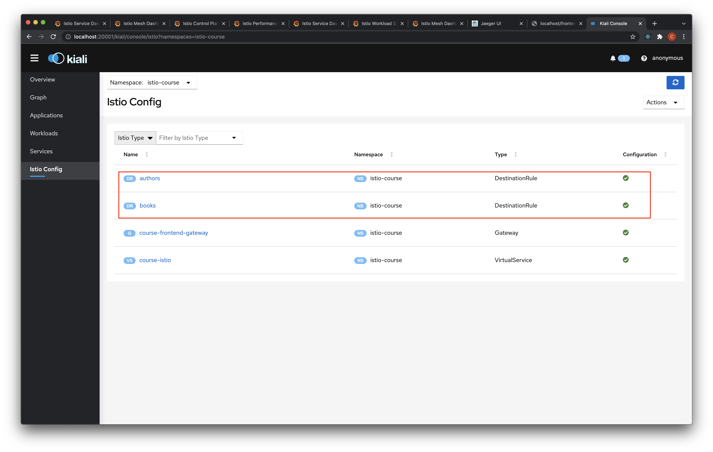
    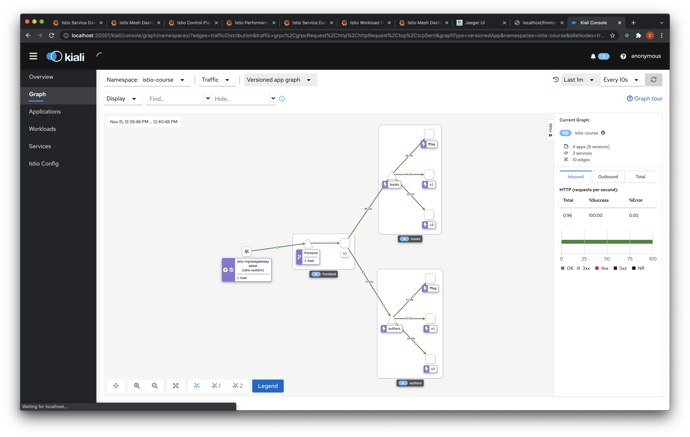

4. Deploy

    Now let's start calling frontend service to verify configured RANDOM and ROUND_ROBIN load balancers.
    ```
    > watch -n 1 curl -o /dev/null -s -w %{http_code} localhost:80/frontend-catalog/api/v1/dashboard
    ```

    Verify that distribution works as expected.
    <figure class="video_container">
    <video controls="true" allowfullscreen="true" width="640" height="480" poster="https://kubernetes.io/images/favicon.png">
        <source src="./screenshots/resiliency-lb.mov">
    </video>
    </figure>

    Now let's start calling frontend service to verify configured RANDOM and ROUND_ROBIN load balancers.
    ```
    > watch -n 1 curl -o /dev/null -s -w %{http_code} localhost:80/frontend-catalog/api/v1/dashboard
    ```

    Verify that circut breaking sometimes happens.
    <figure class="video_container">
    <video controls="true" allowfullscreen="true" width="640" height="480" poster="https://kubernetes.io/images/favicon.png">
        <source src="./screenshots/resiliency-circut-break.mov">
    </video>
    </figure>