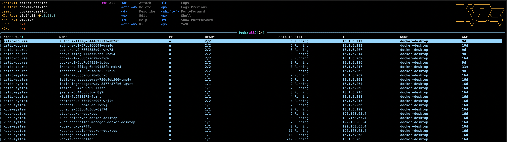
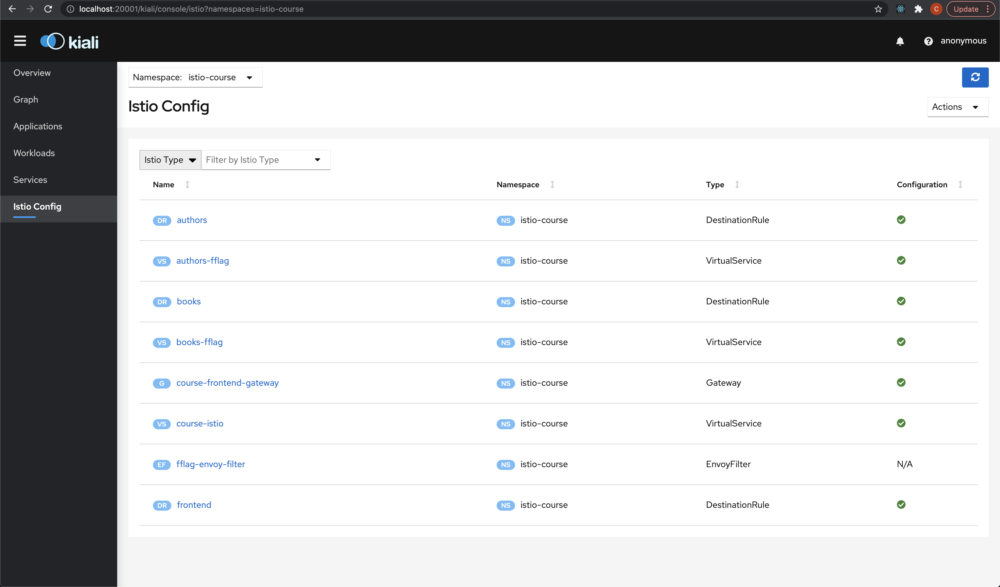
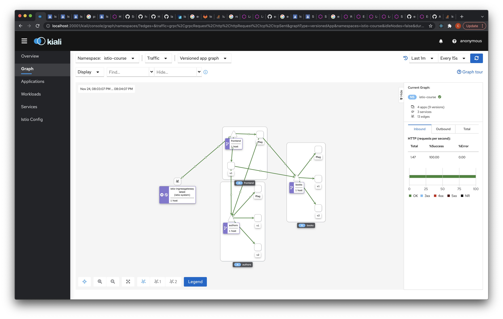
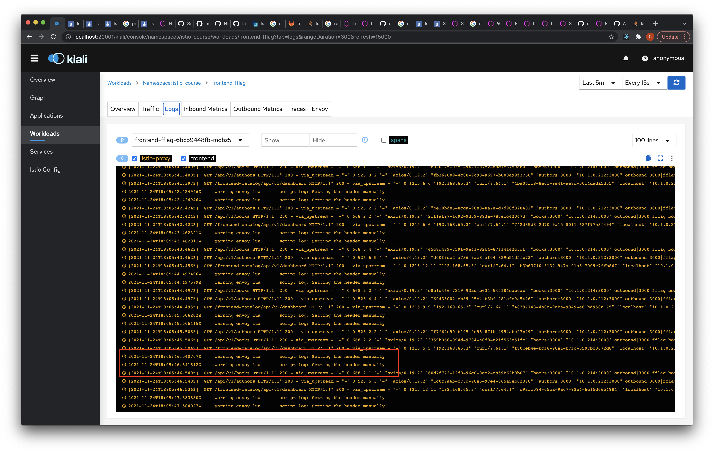
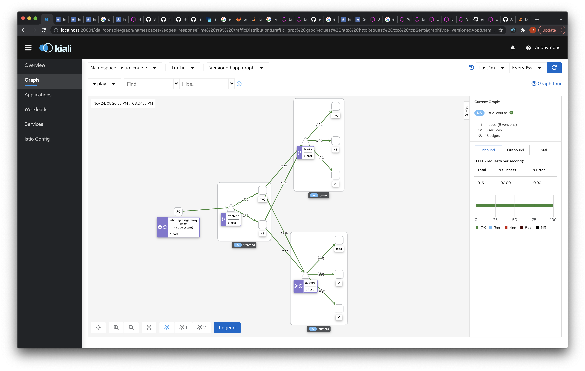
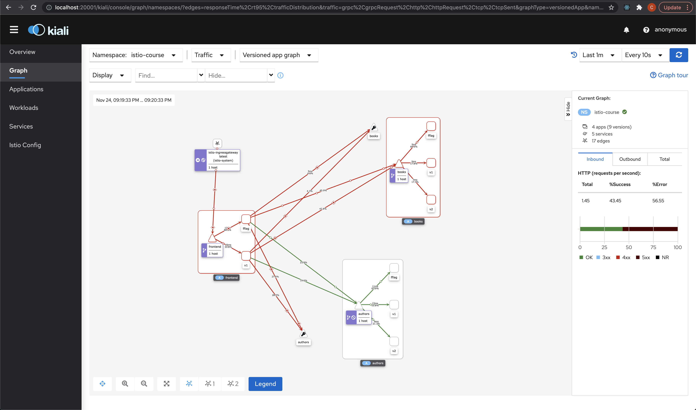

# Table of Contents  
* [Prerequisities](#prerequisities)
* [Feature flag pass](#fflag)
    1. [Prepare deployment files](#fflag-depl)
    2. [Prepare destination rules](#fflag-dr)
    3. [Prepare virtual services](#fflag-vs)
    4. [Prepare envoy filter](#fflag-ef)
    5. [Deploy setup](#fflag-deploy)
    6. [Test](#fflag-test)
* [Deplay injection](#delay)
* [Fault injection](#fault)

<div id="prerequisities"/>

## Prerequisities

Follow [instructions from hw3](../hw2/README.md) to setup v1, v2, fflag applications state with k8s and istio setup.

<div id="fflag"/>

## Feature flag pass

<div id="fflag-depl"/>

1. Prepare deployment files

    In order to be able to test feature flag passing without the code changes - remove the header passing logic from frontend service and republish the image for `1.0` version
    ```
    > docker build -t kreyyser/frontend-service:1.0 -f frontend/Dockerfile frontend
    ```

    Now restart the running pod to stop passing the header to `authors` and `books` services.

    The next step is to prepare the `fflag` version of the deployment. It will use the same image as `v1` version.

<div id="fflag-dr"/>

2. Prepare destination rules

    Now we should prepare DestionRule files for all the three services to define route subsets by the deployment labels.
    We have to do it for all the three services we have.

<div id="fflag-vs"/>

3. Prepare destination rules

    Next step is to prepare virtual services for all the the three services we have.
    `authors`/`books` example should just have case for the header coming and 50/50 for `v1`/`v2` requests distribution without header:
    ```
    - match:
        - headers:
            developer:
            exact: kreyser
        route:
        - destination:
            host: books
            subset: fflag
    - route:
        - destination:
            host: books
            subset: v1
        weight: 50
        - destination:
            host: books
            subset: v2
        weight: 50
    ```

    For the `frontend` service we have only 2 version `v1` and `fflag` and as it is our point to enter the application we should prepare proper matching:
    ```
    - match:
        - headers:
            developer:
            exact: kreyser
        uri:
            prefix: /frontend-catalog/api/v1/
        rewrite:
            uri: /api/v1/
        route:
        - destination:
            host: frontend
            subset: fflag
            port:
            number: 3000
    - match:
        - uri:
            prefix: /frontend-catalog/api/v1/
        rewrite:
            uri: /api/v1/
        route:
        - destination:
            host: frontend
            subset: v1
            port:
            number: 3000
    ```

<div id="fflag-ef"/>

4. Prepare envoy filter


    Now the most interesting part comes to a place. We can prepare EnvoyFilter scoped to a `fflag` version of the `frontend` service to add the header to the outbound requests (coming from frontend service)
    ```
      - applyTo: HTTP_FILTER
        match:
        context: SIDECAR_OUTBOUND
        listener:
            filterChain:
            filter:
                name: envoy.filters.network.http_connection_manager
                subFilter:
                name: "envoy.filters.http.router"
        patch:
        operation: INSERT_BEFORE
        value:
        name: envoy.lua
        typed_config:
            '@type': type.googleapis.com/envoy.extensions.filters.http.lua.v3.Lua
            inline_code: |
                function envoy_on_request(request_handle)
                request_handle:headers():add("developer","kreyser")
                end
    ```

<div id="fflag-deploy"/>

5. Deploy fflag setup

    To deploy the prepared setup just run the following command from `hw4` directory
    ```
    > make deploy-fflag
    kubectl apply -f ./k8s/depl.yaml
    deployment.apps/frontend-fflag configured
    kubectl apply -f ./k8s/dr.yaml
    destinationrule.networking.istio.io/authors unchanged
    destinationrule.networking.istio.io/books unchanged
    destinationrule.networking.istio.io/frontend unchanged
    kubectl apply -f ./k8s/vs.yaml
    virtualservice.networking.istio.io/authors-fflag unchanged
    virtualservice.networking.istio.io/books-fflag unchanged
    virtualservice.networking.istio.io/course-istio unchanged
    kubectl apply -f ./k8s/ef.yaml
    envoyfilter.networking.istio.io/fflag-envoy-filter configured
    ```

<div id="fflag-test"/>

6. Test the deployed setup

    To test the setup we should first verify we have every deployment is up and running
    

    Now let's verify that istio networking configuration doesn't have any errors and is present
    

    Next step - start the API calls with header and without
    ```
    > watch curl -o /dev/null -s -w %{http_code} localhost:80/frontend-catalog/api/v1/dashboard
    > watch -n 1 curl -H "developer:kreyser" -o /dev/null -s -w %{http_code} localhost:80/frontend-catalog/api/v1/dashboard
    ```

    Now let's verify we are seeing the reuests coming to all the versions of the services we have
    

    Verify EnvoyFilter takes place in the pipeline
    

    Now let's verify everything manually
    <figure class="video_container">
    <video controls="true" allowfullscreen="true" width="640" height="480" poster="https://kubernetes.io/images/favicon.png">
        <source src="./screenshots/verification.mov">
    </video>
    </figure>

<div id="delay"/>

## Delay injection

To test the delay injection we can add 40 seconds deplay to half of the non feature flagged requests to authors service.

Lets change `authors` VirtualService to have the following

```
    http:
    - match:
        - headers:
            developer:
            exact: kreyser
        route:
        - destination:
            host: authors
            subset: fflag
    - fault:
        delay:
            percentage: 
                value: 50
            fixedDelay: 40s
        route:
        - destination:
            host: authors
            subset: v1
            weight: 50
        - destination:
            host: authors
            subset: v2
            weight: 50
```

To deploy the changes run the following
```
> make deploy-delay
kubectl apply -f ./k8s/vs-delay.yaml
virtualservice.networking.istio.io/authors-fflag configured
```

Wait for some time and check the kiali


<div id="fault"/>

## Fault injection

To test the fault injection we can add 500 response to the half of the non feature flagged requests to authors service.

Lets change `authors` VirtualService to have the following

```
    http:
    - match:
        - headers:
            developer:
            exact: kreyser
        route:
        - destination:
            host: authors
            subset: fflag
    - fault:
        abort:
            percentage: 
                value: 50
            httpStatus: 500
        route:
        - destination:
            host: authors
            subset: v1
            weight: 50
        - destination:
            host: authors
            subset: v2
            weight: 50
```

To deploy the changes run the following
```
> make deploy-fault
kubectl apply -f ./k8s/vs-fault.yaml
virtualservice.networking.istio.io/authors-fflag configured
```

Wait for some time and check the kiali


