# Table of Contents  
* [Prerequisities](#prerequisities)
* [mTLS](#mtls)
    1. [Deploy mTLS](#mtls-depl)
    2. [Verify mTLS](#mtls-test)
* [Auth](#auth)
    1. [End-user authentication](#auth-ra)
    2. [End-user authorization](#auth-ap)

<div id="prerequisities"/>

## Prerequisities

Follow [instructions from hw4](../hw4/README.md) to setup v1, v2, fflag applications state with k8s and istio setup and run the calls to cluster.
Also to remove the fault or delay injection from the previous session run the following to deploy back the original virtual services
```bash
> make deploy-stable-vs
virtualservice.networking.istio.io/authors-fflag configured
virtualservice.networking.istio.io/books-fflag unchanged
virtualservice.networking.istio.io/course-istio unchanged
```

<div id="mtls"/>

## mTLS

<div id="mtls-depl"/>

1. Deploy mTLS

    To force the traffic between the sidecars to be encrypted we should prepare the PeerAuthentication policy with the `STRICT` mode of the TLS.
    ```yaml
    apiVersion: security.istio.io/v1beta1
    kind: PeerAuthentication
    metadata:
        name: default
        namespace: istio-course
    spec:
        mtls:
            mode: STRICT
    ```
    
    To deploy the change run the following
    ```bash
    > make deploy-mtls
    kubectl apply -f ./k8s/pa.yaml
    peerauthentication.security.istio.io/default created
    ```

    It will deploy the PeerAuthentication to the `istio-course` namespace.

<div id="mtls-test"/>

2. Verify mTLS enabled for namespace

    After we deployed PeerAuthentication we should see that all the traffic from and to namespace should have mTLS.
    First place to check it is the kiali overview panel with mTLS filter should show the `istio-course` namespace.
    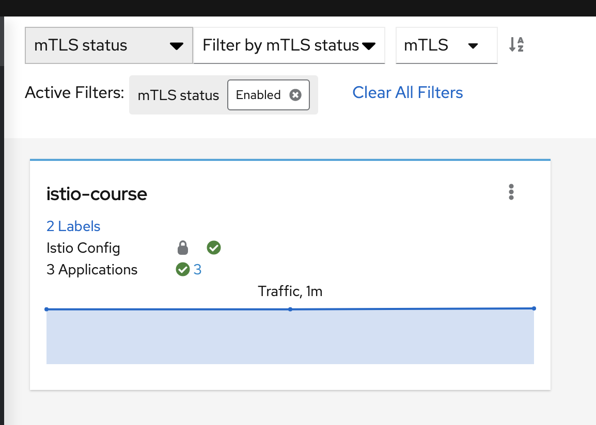

    After that let's make sure traffic from `frontend` service to `authors` service is secure.
    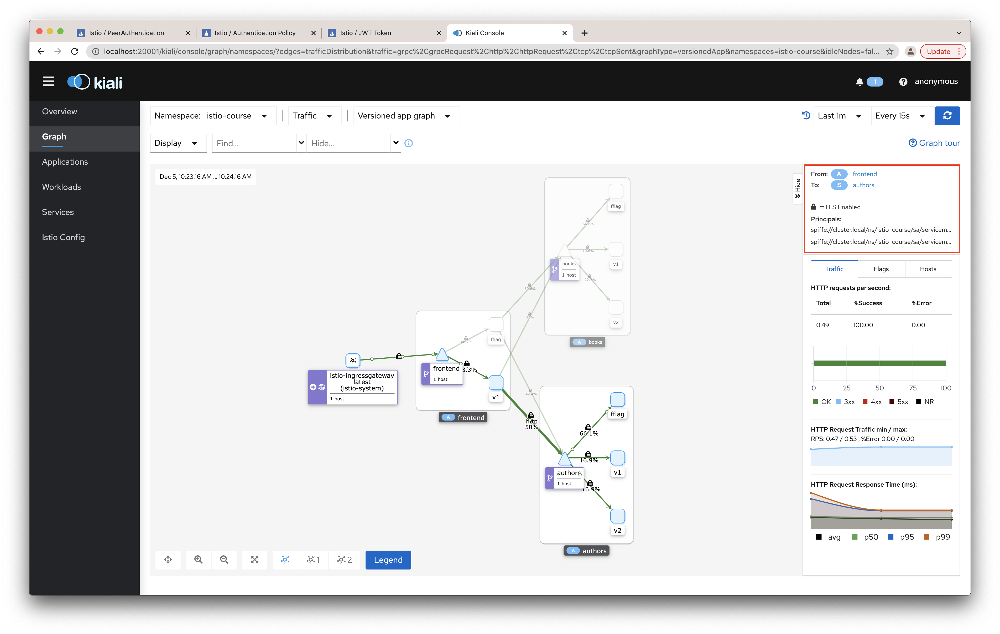

    After that let's make sure traffic from `frontend` service to `books` service is secure.
    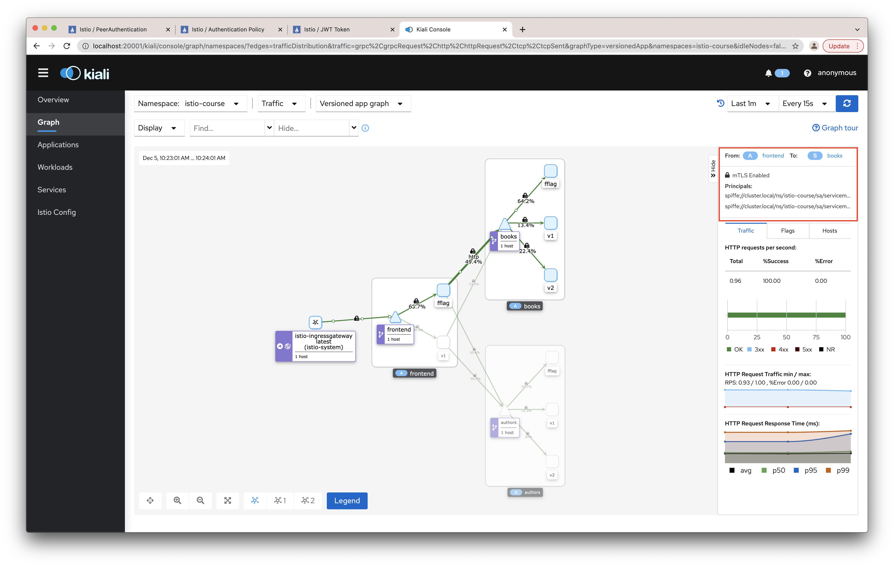
    
    And finally, let's make sure traffic coming to the `frontend` service is secure.
    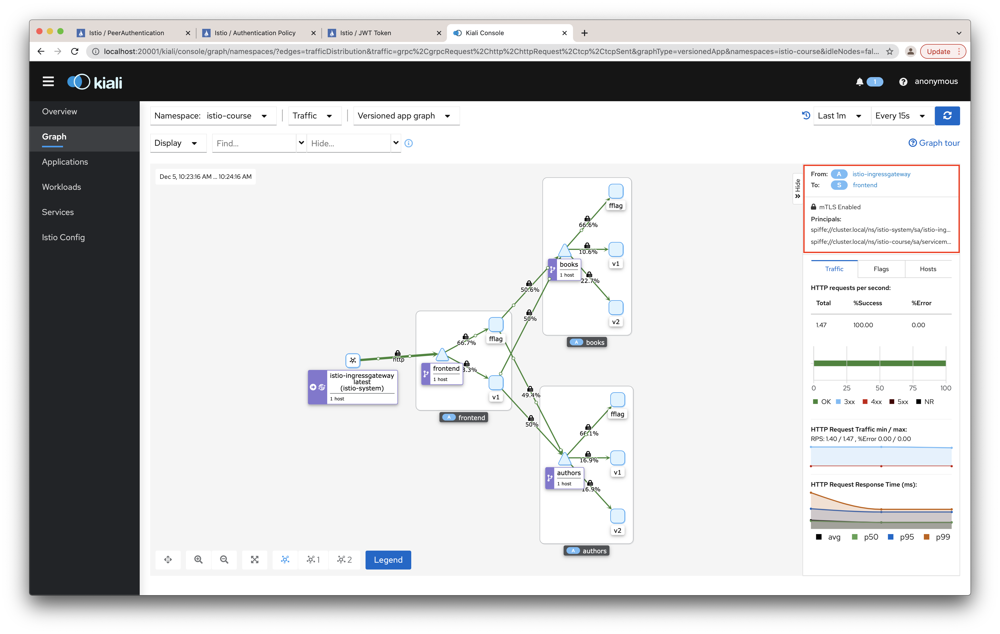

<div id="auth"/>

## Auth

To secure the incoming calls to the frontend gateway we can use any of the OAuth 2.0 or OIDC 1.0 IDP as the authentication source.

Istio provides the test IDP and the proper public key set to validate the JWT tokens.
```bash
> curl https://raw.githubusercontent.com/istio/istio/release-1.12/security/tools/jwt/samples/jwks.json | jq
{
    "keys": [
        {
            "e": "AQAB",
            "kid": "DHFbpoIUqrY8t2zpA2qXfCmr5VO5ZEr4RzHU_-envvQ",
            "kty": "RSA",
            "n": "xAE7eB6qugXyCAG3yhh7pkDkT65pHymX-P7KfIupjf59vsdo91bSP9C8H07pSAGQO1MV_xFj9VswgsCg4R6otmg5PV2He95lZdHtOcU5DXIg_pbhLdKXbi66GlVeK6ABZOUW3WYtnNHD-91gVuoeJT_DwtGGcp4ignkgXfkiEm4sw-4sfb4qdt5oLbyVpmW6x9cfa7vs2WTfURiCrBoUqgBo_-4WTiULmmHSGZHOjzwa8WtrtOQGsAFjIbno85jp6MnGGGZPYZbDAa_b3y5u-YpW7ypZrvD8BgtKVjgtQgZhLAGezMt0ua3DRrWnKqTZ0BJ_EyxOGuHJrLsn00fnMQ"
        }
    ]
}
```

And also JWT token to check the authentication is provided
```bash
> TOKEN=$(curl https://raw.githubusercontent.com/istio/istio/release-1.12/security/tools/jwt/samples/demo.jwt -s) && echo "$TOKEN" | cut -d '.' -f2 - | base64 --decode - | jq
{
    "exp": 4685989700,
    "foo": "bar",
    "iat": 1532389700,
    "iss": "testing@secure.istio.io",
    "sub": "testing@secure.istio.io"
}
```

<div id="auth-ra"/>

1. End-user authentication

    To enable the authentication lets prepare `RequestAuthentication` deployment with the issuer and jwks URL provided by Istio

    ```yaml
    apiVersion: security.istio.io/v1beta1
    kind: RequestAuthentication
    metadata:
        name: "jwt-request-authentication"
        namespace: istio-course
    spec:
        selector:
            matchLabels:
                app: frontend
        jwtRules:
        - issuer: "testing@secure.istio.io"
        jwksUri: "https://raw.githubusercontent.com/istio/istio/release-1.12/security/tools/jwt/samples/jwks.json"
    ```

    You can deploy it by running the following command
    ```bash
    > make deploy-ra
    kubectl apply -f ./k8s/ra.yaml
    requestauthentication.security.istio.io/jwt-request-authentication created
    ```

    Let's verify configurations doesn't have the errors
    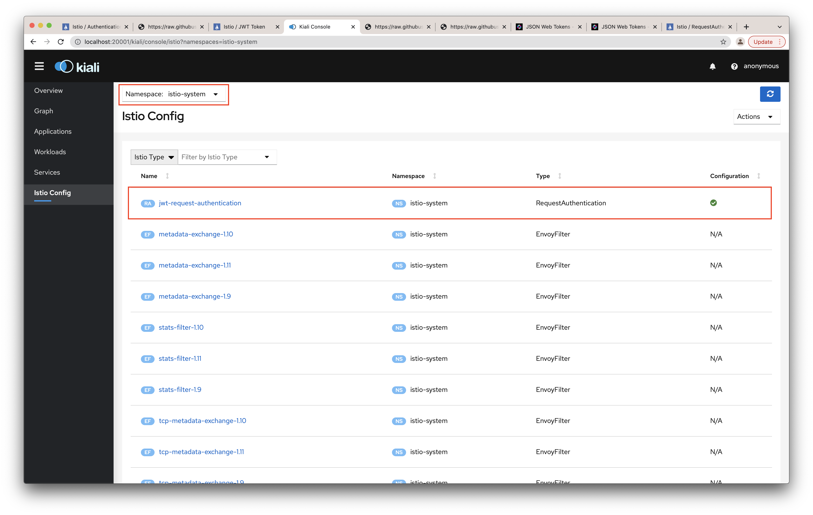

    Second part of the verification is the requests with/without `Authorization` header.

    - requests without JWT token in `Authorization` should be treated as allowed
    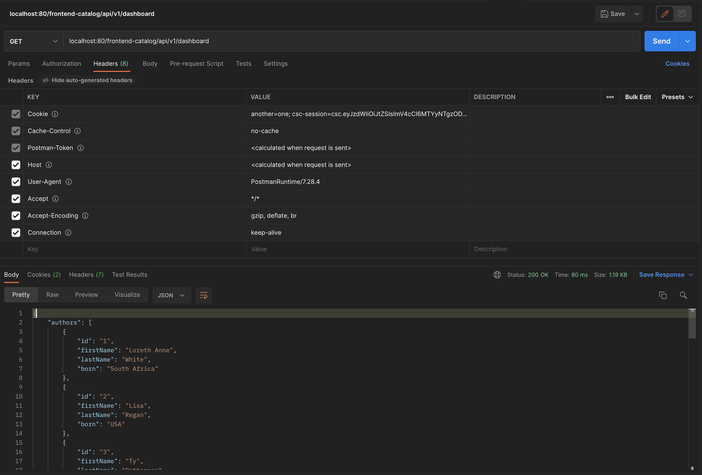

    - requests with wrong `Authorization` header value should be treated as unauthorized.
    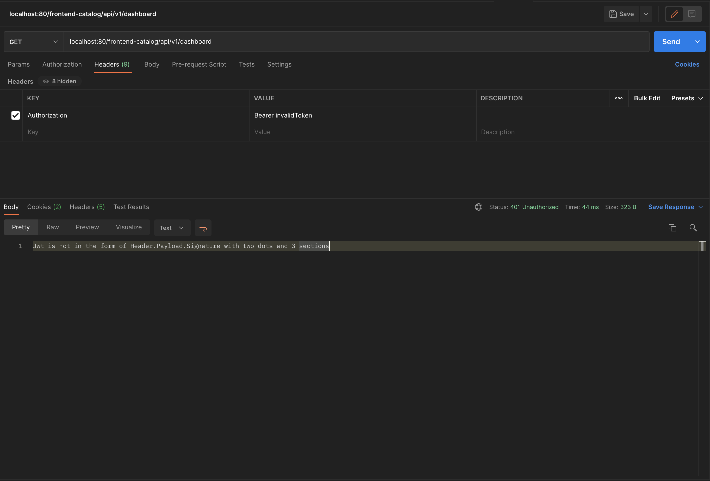

    - requests with wrong JWT signature should be treated as unauthorized.
    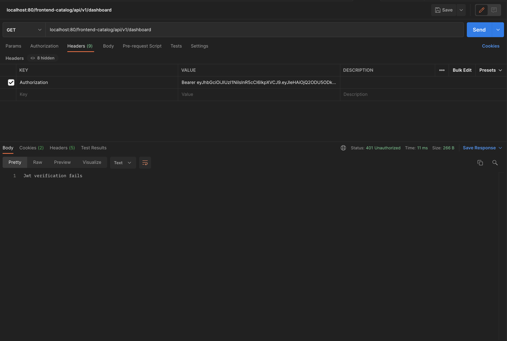

    - requests with valid JWT token should be allowed.
    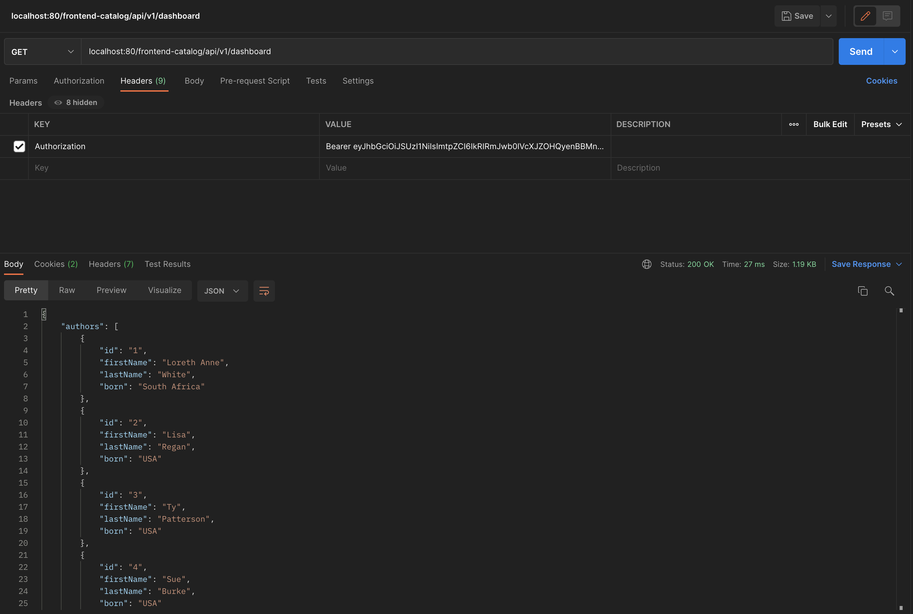


<div id="auth-ra"/>

2. End-user authorization

    To enable the authorization lets prepare `AuthorizationPolicy` deployment for our `frontend` service.
    It allows requests to the `frontend` service only with a valid JWT token issued by `testing@secure.istio.io` and issued for `testing@secure.istio.io` with a `scope1` in the list of `scope` claim.

    ```yaml
    apiVersion: security.istio.io/v1beta1
    kind: AuthorizationPolicy
    metadata:
        name: "jwt-scope-ap"
        namespace: istio-course
    spec:
        selector:
            matchLabels:
                app: frontend
        action: ALLOW
        rules:
        - from:
            - source:
                requestPrincipals: ["testing@secure.istio.io/testing@secure.istio.io"]
            when:
            - key: request.auth.claims[scope]
              values: ["scope1"]
    ```

    You can deploy it by running the following command
    ```bash
    > make deploy-ap
    kubectl apply -f ./k8s/ap.yaml
    authorizationpolicy.security.istio.io/jwt-scope-ap created
    ```

    Let's verify configurations doesn't have the errors
    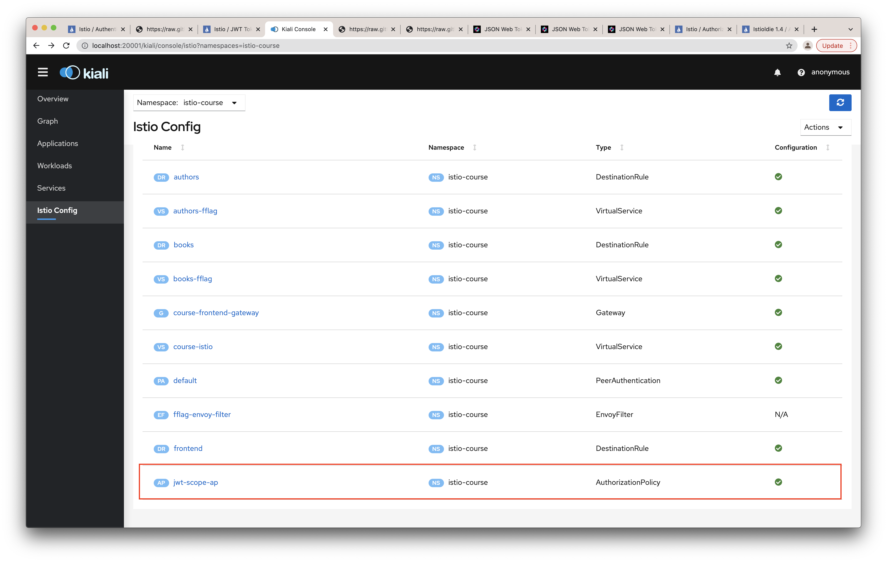

    Second part of the verification is the requests with/without `Authorization` header.

    - requests without JWT token in `Authorization` should be treated as forbidden
    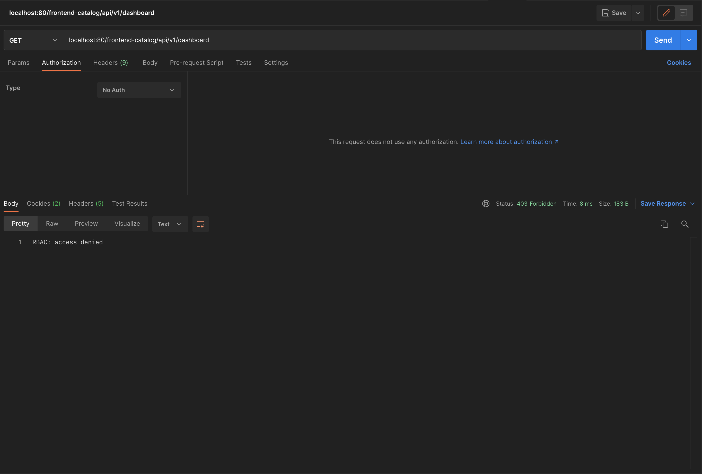

    - requests with wrong `Authorization` header value should be treated as unauthorized.
    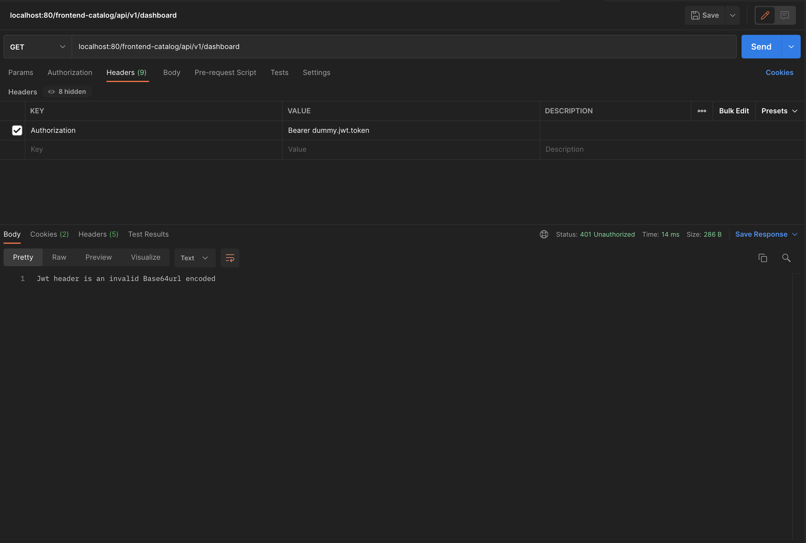

    - requests with valid JWT token but without the requested scopes hould be treated as unauthorized.
    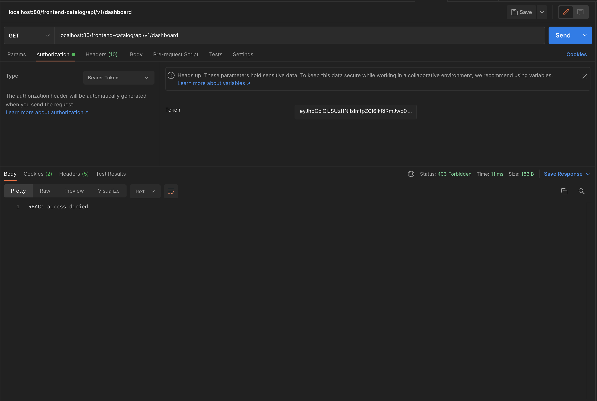

    - requests with valid JWT token and with `scope1` present in the `scope` claim should be allowed.
    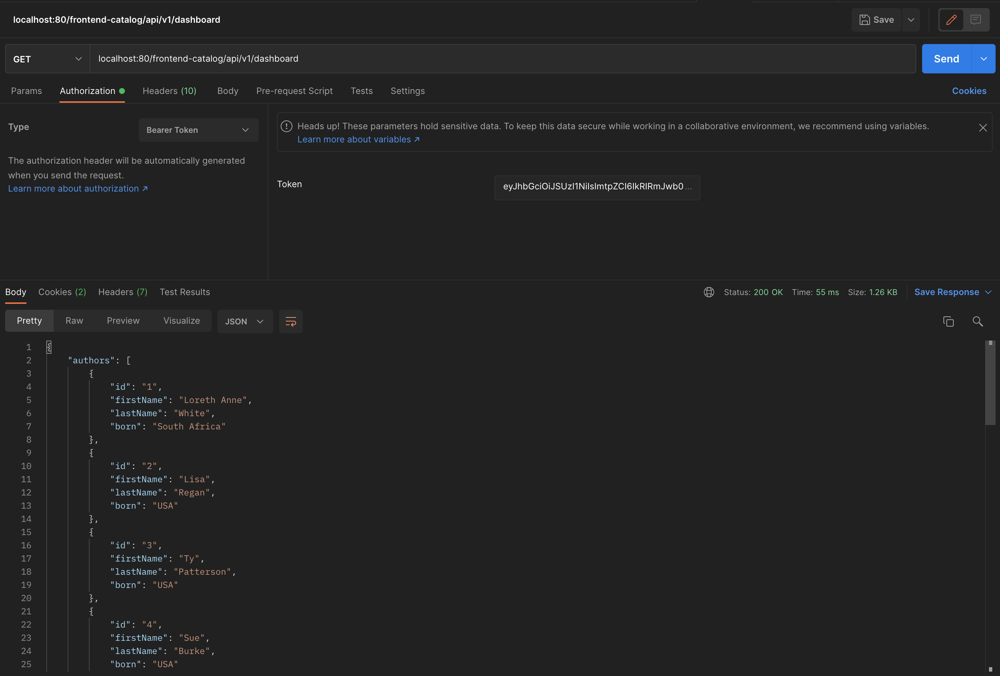